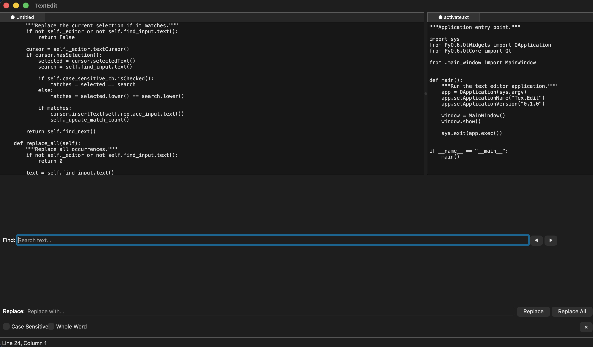

# TextEdit



A cross-platform text editor built with PyQt6 featuring multi-file tabs, split views, and find/replace functionality.

## Getting Started

### Prerequisites

- **Python 3.10 or higher** (tested with Python 3.14)
- **pip** (Python package installer)
- **Qt platform dependencies** (usually pre-installed on macOS/Windows, may require installation on Linux)

### Installation

1. **Clone the repository:**
   ```bash
   git clone <repository-url>
   cd textedit_u1351484
   ```

2. **Create a virtual environment:**
   ```bash
   python3 -m venv .venv
   ```

3. **Activate the virtual environment:**
   
   On macOS/Linux:
   ```bash
   source .venv/bin/activate
   ```
   
   On Windows:
   ```bash
   .venv\Scripts\activate
   ```

4. **Install dependencies:**
   ```bash
   pip install -r requirements.txt
   ```

### Running the Application

Once dependencies are installed, run the text editor with:

```bash
python main.py
```

Or using the module:

```bash
python -m src.app
```

The application window will open with a blank editor tab ready to use.

### Running Tests

To run the test suite:

```bash
pytest
```

To run specific test files:

```bash
pytest tests/test_editor.py
pytest tests/test_find_replace.py
pytest tests/test_multi_file_find.py
```

To run with verbose output:

```bash
pytest -v
```

**Note:** GUI tests may fail in headless environments (CI servers without display). This is a known limitation with PyQt6 testing.

### Platform-Specific Notes

**macOS:**
- No additional setup required
- Uses native Cocoa platform integration

**Linux:**
- May require installing Qt platform plugins:
  ```bash
  sudo apt-get install libxcb-xinerama0  # Ubuntu/Debian
  ```

**Windows:**
- No additional setup required
- Uses native Windows integration

### Troubleshooting

**"No module named PyQt6":**
- Ensure virtual environment is activated
- Run `pip install -r requirements.txt` again

**"command not found: python":**
- Try `python3` instead of `python`
- Ensure Python 3.10+ is installed

**Application won't start:**
- Check that you have a display/GUI environment
- Try running a simple PyQt6 test: `python -c "from PyQt6.QtWidgets import QApplication; print('OK')"`

---

# R1

## Core Editing

Built on PyQt6's `QPlainTextEdit` with all the basics working: text editing, undo/redo, cut/copy/paste, and some nice extras like duplicate line (Ctrl+Shift+D), delete line (Ctrl+Shift+K), and move lines up/down (Alt+Up/Down). Uses Menlo font with 4-space tabs.

The `TextEditor` class is pretty straightforward—it handles file I/O and emits signals when things change. This keeps the UI stuff (tabs, status bar) decoupled from the actual editing logic, which makes testing way easier.

**Tests**: `tests/test_editor.py` has `TestEditorBasics` and `TestLineOperations` covering the main functionality.

## Opening and Saving Files

Files are saved/loaded with UTF-8 encoding. The editor shows a ● in the tab title when you have unsaved changes, and prompts you before closing modified files so you don't lose work.

One nice touch: if you try to open a file that's already open in another tab, it just switches to that tab instead of opening it twice. Empty "Untitled" tabs get reused when you open files too.

The architecture splits things cleanly—`TextEditor` does the actual file I/O, while `EditorTabWidget` handles the dialogs and UI stuff.

**Tests**: `TestFileOperations` covers save/load, error handling, and edge cases.

## Basic Tab Support

Multiple files can be opened in tabs with closable tab buttons. Tab titles update to show the filename and modification state. The `EditorTabWidget` manages the lifecycle of multiple editor instances, each with its own undo/redo stack and file state.

---

# R2

## Tabs and Split Views

This is where things get more interesting. You can have multiple files open in tabs (drag to reorder, Ctrl+Tab to cycle), and you can split the window horizontally or vertically to view files side-by-side.

The split system uses Qt's `QSplitter` with a tree structure, so you can nest splits in any direction. When you close the last tab in a split, it automatically cleans itself up. The tricky part was tracking which split is "active" for operations like save—I ended up using focus events and keeping an `_active_tabs` reference.

Splits have visible gray handles (4px wide) that turn blue on hover, making them easy to grab and drag to resize panes. This was a key usability improvement over invisible handles.

Shortcuts: Ctrl+\\ to split right, Ctrl+Shift+\\ to split down, Ctrl+Shift+X to close a split.

**Tests**: Manual testing for splits. The underlying editor tests cover the tab functionality.

## Keyboard Shortcuts

Added comprehensive keyboard shortcuts for all major operations:
- File operations (Ctrl+N, Ctrl+O, Ctrl+S, Ctrl+W)
- Editing (Ctrl+Z/Shift+Z for undo/redo, Ctrl+D/L for select word/line)
- Line manipulation (Alt+Up/Down, Ctrl+Shift+D/K)
- Navigation (Ctrl+G for go to line, Ctrl+Tab for next tab)
- Split navigation (Ctrl+Alt+Left/Right)

All shortcuts are registered through Qt's action system and displayed in menus for discoverability.

---

# R3

## Find and Replace

Built a find/replace bar that sits at the bottom of the window. Has all the standard features: find next/previous (F3/Shift+F3), case-sensitive search, whole-word matching, replace single, and replace all. Shows a match counter and auto-populates with your current selection when you open it.

The implementation uses Qt's `QTextDocument.find()` with the appropriate flags. Replace-all uses edit blocks so it's a single undo operation. One thing I noticed: the match counter recalculates on every keystroke by scanning the whole document, which could be slow for huge files but gives nice instant feedback.

**Tests**: 12 tests in `tests/test_find_replace.py` covering search directions, wrap-around, case sensitivity, whole words, and replace operations.

## Quick Usage Guide

### Basic Operations

**Opening Files:**
- File → Open (Ctrl+O)
- Drag and drop files onto the window
- Command line: `python main.py /path/to/file.txt`

**Saving Files:**
- File → Save (Ctrl+S) - save current file
- File → Save As (Ctrl+Shift+S) - save with new name

**Creating Tabs:**
- File → New (Ctrl+N) - new tab
- File → Open (Ctrl+O) - open file in new tab
- Ctrl+W - close current tab
- Ctrl+Tab - switch to next tab

**Split Views:**
- View → Split Right (Ctrl+\\) - split horizontally
- View → Split Down (Ctrl+Shift+\\) - split vertically  
- View → Close Split (Ctrl+Shift+X) - close current split
- Ctrl+Alt+Left/Right - navigate between splits
- Drag the gray split handles to resize panes

**Text Editing:**
- Ctrl+Z / Ctrl+Shift+Z - undo/redo
- Ctrl+X / Ctrl+C / Ctrl+V - cut/copy/paste
- Ctrl+D - select word
- Ctrl+L - select line
- Ctrl+A - select all

**Line Operations:**
- Ctrl+Shift+D - duplicate current line
- Ctrl+Shift+K - delete current line
- Alt+Up / Alt+Down - move line up/down

**Find and Replace:**
- Ctrl+F - open find/replace bar
- F3 / Shift+F3 - find next/previous
- Type search term and press Enter
- Enable case-sensitive or whole-word matching
- Use Replace or Replace All buttons

**Navigation:**
- Ctrl+G - go to line number
- Click line/column indicator in status bar

### Tips

- The editor auto-saves modification state (● indicator in tab)
- Closing modified files prompts to save
- Opening an already-open file switches to that tab
- Empty "Untitled" tabs are reused when opening files
- All keyboard shortcuts are visible in menus

## Architecture

The code is split into modular pieces:
- `TextEditor` - core editing widget
- `EditorTabWidget` - manages tabs
- `SplitContainer` - handles split views
- `FindReplaceWidget` - search/replace
- `MainWindow` - ties it all together

Everything communicates via Qt signals/slots, which keeps things loosely coupled.

## What I Built

For this assignment I picked two features from the list:

1. **Multi-file support, tabs, and split views** - fully working with drag-to-reorder, nested splits, and smart duplicate handling
2. **Find and replace** - complete with case-sensitive/whole-word options, replace all, and match counting

## What Erik Hilton added

For Assignment 2 I added a file explorer tree:

1. **FileTree Explorer** - a fully operational file tree that mimics the user's file system. The editor opens compatable files and is compatible with find/replace and split view functionality. A file_tree.py file has been added in the src folder. Pycache has been updated. A test file called test_filetree.py has been added to the test folder with 26 tests that all pass.
